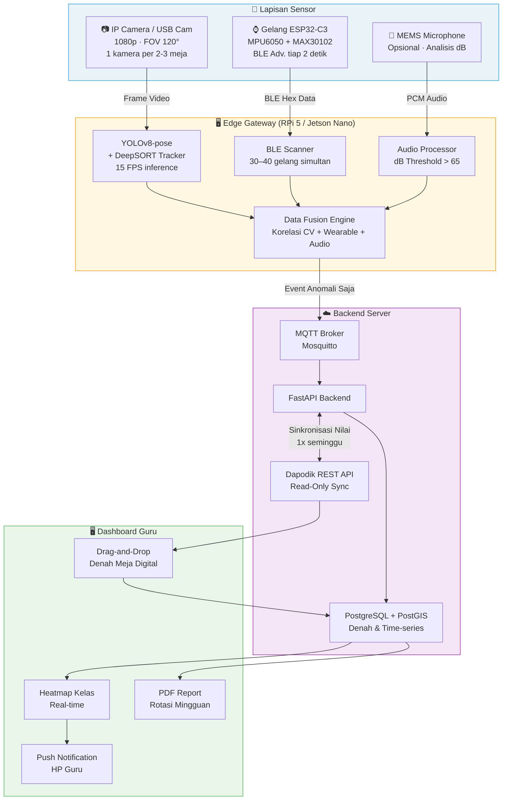
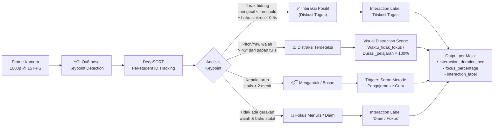
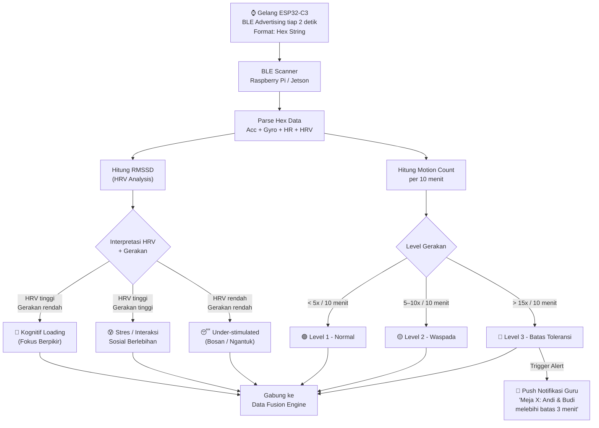
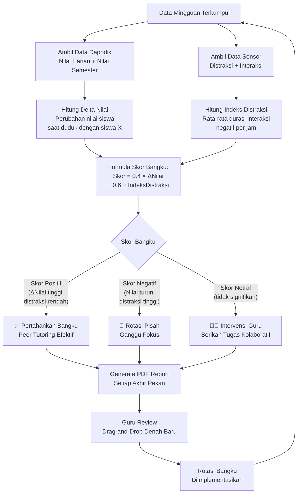
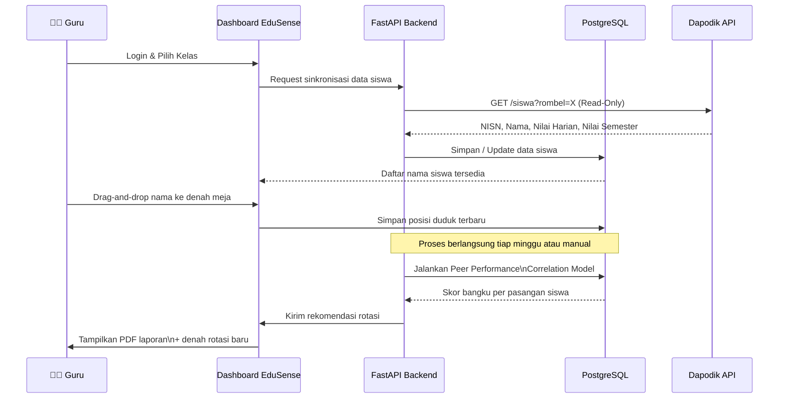
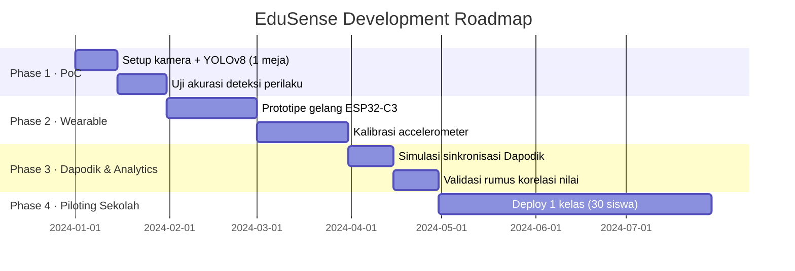

# 🎓 EduSense: Adaptive Seating & Peer Interaction Analyzer

<div align="center">


**Sistem berbasis Computer Vision dan Wearable IoT untuk menganalisis interaksi antar siswa, mendeteksi tingkat fokus secara real-time, dan menghasilkan rekomendasi rotasi bangku adaptif yang terintegrasi dengan Dapodik.**

[Tentang Proyek](#-tentang-proyek) · [Arsitektur Sistem](#-arsitektur-sistem) · [Hardware](#-spesifikasi-hardware) · [Algoritma](#-algoritma-adaptive-seating) · [Instalasi](#-instalasi) · [Roadmap](#-roadmap)

</div>

---

## 📌 Tentang Proyek

EduSense menjawab satu masalah konkret: guru tidak bisa memantau 30 siswa sekaligus. Sistem ini memasang kamera wide-angle dan gelang wearable ringan di setiap meja, lalu memproses data secara lokal di edge device (Raspberry Pi / Jetson Nano) sebelum dikirim ke dashboard guru.

Output utamanya ada dua:
1. **Heatmap real-time** — guru melihat meja mana yang "panas" (gaduh/tidak fokus) dalam hitungan detik
2. **Laporan rotasi bangku mingguan** — rekomendasi PDF otomatis berbasis korelasi nilai Dapodik dan data perilaku sensor

### Mengapa EduSense?

| Masalah | Solusi EduSense |
|---|---|
| Guru tidak tahu siapa yang mengobrol di belakang | YOLO pose + BLE gelang mendeteksi interaksi negatif secara otomatis |
| Penempatan bangku berdasarkan intuisi, bukan data | Algoritma korelasi nilai × distraksi menghasilkan saran spesifik per pasangan siswa |
| Data Dapodik tidak terhubung ke kondisi kelas | Sinkronisasi mingguan, lalu guru drag-and-drop nama ke denah meja digital |
| Server cloud mahal dan lambat untuk video | Edge inference di Raspberry Pi — cloud hanya menerima anomali, bukan raw video |

---

## 🔄 Arsitektur Sistem

### Alur Data Utama



---

### Alur Proses Computer Vision



---

### Alur Proses Wearable (Gelang)



---

### Alur Algoritma Adaptive Seating



---

### Alur Integrasi Dapodik



---

## 🔧 Spesifikasi Hardware

### Kamera

| Parameter | Detail |
|---|---|
| Tipe | Wide-angle USB Camera 1080p / IP Camera RTSP |
| Field of View | Minimal 120° horizontal |
| Penempatan | Depan kelas, sudut 45° menghadap meja |
| Cakupan | 1 kamera per 2–3 meja (4–6 siswa) |
| Rekomendasi | Logitech C930e atau ESP32-CAM |

### Gelang Wearable

| Parameter | Detail |
|---|---|
| MCU | ESP32-C3 Mini (BLE 5.0) |
| Sensor Gerak | MPU6050 — Accelerometer & Gyroscope |
| Sensor Biometrik | MAX30102 — Heart Rate & HRV |
| Baterai | Li-Po 200mAh (tahan 8 jam) |
| Transmisi | BLE Advertising tiap 2 detik |
| Format Data | Hexadecimal String (ringkas) |

### Gateway (Edge Device)

| Parameter | Detail |
|---|---|
| Hardware | Raspberry Pi 5 4GB atau NVIDIA Jetson Nano |
| Inference | YOLOv8-pose real-time @ 15 FPS |
| BLE Capacity | Scan 30–40 gelang simultan |
| Upload Strategi | Event-based — hanya kirim anomali ke cloud |
| Audio (Opsional) | MEMS Microphone untuk analisis kebisingan (dB) |

---

## 🧠 Model Computer Vision

```
Model   : YOLOv8-pose (Keypoint Detection) + YOLOv8-face (Head Pose)
Tracker : DeepSORT (ID unik per siswa, persisten antar frame)
```

**Keypoint yang dianalisis:**
- `nose` — orientasi wajah (arah pandang)
- `left_shoulder` + `right_shoulder` — postur dan sinkronisasi gerak

**Logika deteksi perilaku:**

| Kondisi | Label | Kalkulasi |
|---|---|---|
| Jarak Euclidean hidung mengecil + bahu sinkron ≤ 0.5s | Diskusi Tugas | Geometri real-time |
| Pitch/Yaw wajah > 45° dari papan tulis | Distraksi | Head pose estimation |
| Kepala turun, HRV rendah, gerak minimal | Mengantuk | Fusi CV + Wearable |
| Wajah stabil menghadap depan | Fokus | Default state |

**Output per meja:**
```json
{
  "desk_id": "M3",
  "interaction_duration_seconds": 142,
  "focus_percentage": 67.4,
  "interaction_label": "Mengobrol"
}
```

---

## 💡 Analisis Wearable (HRV + Gerak)

### Interpretasi HRV (Metode RMSSD)

| Kondisi HRV | Kondisi Gerak | Interpretasi |
|---|---|---|
| Tinggi | Rendah | 🧠 Kognitif Loading — Fokus berpikir dalam |
| Tinggi | Tinggi | 😰 Stres / Interaksi sosial berlebihan |
| Rendah | Rendah | 😴 Under-stimulated — Bosan atau mengantuk |

### Level Ambang Gerakan

| Level | Threshold | Status |
|---|---|---|
| 🟢 Level 1 | < 5 gerakan / 10 menit | Normal |
| 🟡 Level 2 | 5–10 gerakan / 10 menit | Waspada |
| 🔴 Level 3 | > 15 gerakan / 10 menit | Batas toleransi — trigger alert |

> **Korelasi Audio:** Jika kebisingan kelas > 65 dB **dan** gelang bergetar secara bersamaan → sistem menandai kelas sebagai gaduh.

---

## 📊 Algoritma Adaptive Seating

```
Skor_Bangku = (0.4 × Delta_Nilai) − (0.6 × Indeks_Distraksi)
```

| Variabel | Sumber Data | Keterangan |
|---|---|---|
| `Delta_Nilai` | Dapodik | Perubahan nilai mingguan siswa saat duduk bersama siswa X |
| `Indeks_Distraksi` | YOLO + Gelang | Rata-rata durasi interaksi negatif per jam |

**Output rekomendasi:**

| Hasil Skor | Rekomendasi | Keterangan |
|---|---|---|
| Positif | ✅ Pertahankan Bangku | Peer tutoring berlangsung efektif |
| Negatif | 🔄 Rotasi Pisah | Keberadaan teman ini menurunkan fokus |
| Netral | 👨‍🏫 Intervensi Guru | Berikan tugas kolaboratif terstruktur |

Laporan PDF digenerate otomatis setiap akhir pekan, berisi saran rotasi spesifik per pasangan meja.

---

## 🖥️ Fitur Dashboard

### Real-time Heatmap Kelas

```
🔵 Biru   → Fokus   (HRV stabil, wajah menghadap depan)
🟠 Oranye → Waspada (1 siswa tidak fokus / gelisah)
🔴 Merah  → Kritis  (Batas toleransi bercanda terlampaui)
```

Notifikasi langsung ke HP guru:
> *"Meja 3: Andi & Budi melebihi batas interaksi 3 menit."*

### Laporan Mingguan (PDF)

- **Saran Pisah:** Nama siswa + alasan (Penurunan nilai −X%, Gelisah Y%)
- **Saran Gabung:** Nama siswa + alasan (Pola HRV sinkron, nilai naik bersama)
- **Evaluasi Metode Mengajar:** Jika >50% wajah menunduk dan HRV rendah → *"Ganti metode ceramah dengan ice breaking."*

---

## 🛠️ Tech Stack

```
Backend     : Python 3.11 + FastAPI + MQTT (Mosquitto)
Frontend    : React.js + Leaflet.js (denah interaktif)
Database    : PostgreSQL + PostGIS
ML / CV     : PyTorch / TensorFlow Lite (edge inference)
Tracking    : YOLOv8-pose + DeepSORT
Deployment  : Docker Compose
```

### Struktur Direktori

```
edusense/
├── edge/                       # Kode untuk Raspberry Pi / Jetson Nano
│   ├── cv_pipeline/
│   │   ├── yolo_inference.py   # YOLOv8-pose inference
│   │   ├── deepsort_tracker.py # DeepSORT tracking
│   │   └── behavior_logic.py   # Logika distraksi & interaksi
│   ├── ble_scanner/
│   │   ├── scanner.py          # BLE Scan 30–40 gelang
│   │   └── hrv_processor.py    # Kalkulasi RMSSD
│   └── data_fusion.py          # Fusi data CV + Wearable + Audio
│
├── backend/                    # FastAPI server
│   ├── main.py
│   ├── routers/
│   │   ├── dapodik.py          # Sinkronisasi Dapodik
│   │   ├── seating.py          # Algoritma rotasi bangku
│   │   └── reports.py          # Generate PDF
│   └── models/                 # SQLAlchemy models
│
├── firmware/                   # Kode ESP32-C3 gelang
│   ├── main.ino
│   ├── mpu6050_reader.h
│   └── max30102_reader.h
│
├── frontend/                   # React.js dashboard
│   ├── src/
│   │   ├── components/
│   │   │   ├── ClassHeatmap.jsx
│   │   │   ├── SeatDragDrop.jsx
│   │   │   └── WeeklyReport.jsx
│   │   └── App.jsx
│
├── docker-compose.yml
└── README.md
```

---

## 🚀 Instalasi

### Prasyarat

- Python 3.11+
- Node.js 20+
- Docker & Docker Compose
- Raspberry Pi 5 / Jetson Nano (untuk edge)
- PostgreSQL 15+ dengan ekstensi PostGIS

### Clone & Setup

```bash
git clone https://github.com/username/edusense.git
cd edusense
```

### Jalankan dengan Docker Compose

```bash
# Copy file environment
cp .env.example .env

# Edit konfigurasi (database, MQTT, Dapodik API key)
nano .env

# Build dan jalankan semua service
docker-compose up --build
```

### Setup Edge Device (Raspberry Pi)

```bash
# Install dependensi
cd edge
pip install -r requirements.txt

# Install YOLOv8
pip install ultralytics

# Jalankan pipeline
python main.py --camera rtsp://192.168.1.100:554/stream --ble-scan
```

### Flash Firmware Gelang

```bash
# Buka firmware/ di Arduino IDE
# Pilih board: ESP32-C3 Dev Module
# Upload main.ino ke ESP32-C3
```

### Akses Dashboard

```
URL     : http://localhost:3000
API     : http://localhost:8000/docs
MQTT    : mqtt://localhost:1883
```

---

## 📅 Roadmap



### Target Metrik Keberhasilan (Phase 4)

| Metrik | Target |
|---|---|
| Penurunan laporan "siswa rame sendiri" | −30% |
| Peningkatan nilai rata-rata kelas setelah rotasi AI | +10% |
| Latensi notifikasi guru | < 5 detik |
| Akurasi deteksi perilaku (CV) | > 85% |

---

## 🔐 Privasi & Etika

- Data video **tidak pernah dikirim ke cloud** — inference berjalan sepenuhnya di edge device
- Cloud hanya menerima **event anomali terstruktur** (JSON), bukan raw video
- Akses Dapodik bersifat **Read-Only** — sistem tidak mengubah atau menulis data Dapodik
- Seluruh data siswa dienkripsi at-rest di PostgreSQL
- Gelang wearable tidak menyimpan data — semua pemrosesan di gateway

---

## 🤝 Kontribusi

1. Fork repositori ini
2. Buat branch fitur: `git checkout -b feature/nama-fitur`
3. Commit perubahan: `git commit -m 'feat: tambah fitur X'`
4. Push ke branch: `git push origin feature/nama-fitur`
5. Buka Pull Request

---

## 📄 Lisensi

Proyek ini berlisensi MIT. Lihat file [LICENSE](LICENSE) untuk detail lengkap.

---

<div align="center">

Dibuat untuk membantu guru Indonesia membuat keputusan berbasis data, bukan asumsi.

**EduSense · IoT Pendidikan · v1.0.0**

</div>
